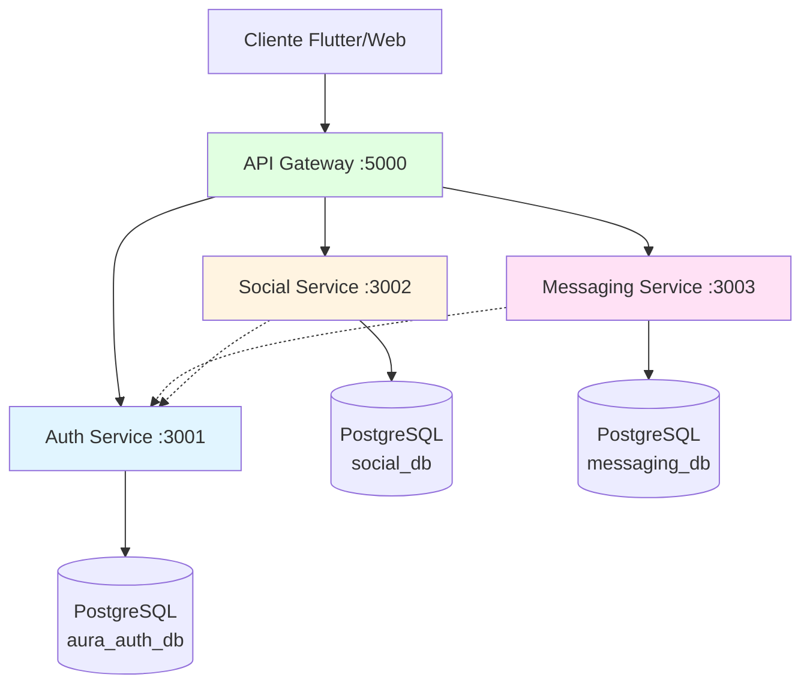

# Evaluación de Seguridad OWASP - Backend Aura

**Proyecto**: Aura Social Network - Backend de Microservicios  
**Fecha**: 22 de Noviembre de 2025  
**Versión**: 1.0  
**Metodología**: OWASP MSTG + STRIDE Threat Modeling

---

## 1. Introducción

### 1.1 Alcance del Análisis

Este documento presenta una evaluación exhaustiva de seguridad del backend de microservicios de la plataforma Aura, una red social que incluye funcionalidades de autenticación, publicaciones, mensajería en tiempo real y gestión de perfiles de usuario.

**Componentes Evaluados**:
- Auth Service (Puerto 3001)
- Social Service (Puerto 3002)
- Messaging Service (Puerto 3003)
- API Gateway (Puerto 5000)

### 1.2 Metodología Aplicada

Se aplicaron las siguientes metodologías de análisis de seguridad:

- **OWASP MSTG** (Mobile Security Testing Guide): Framework para evaluación de arquitectura y controles de seguridad
- **STRIDE**: Modelado de amenazas (Spoofing, Tampering, Repudiation, Information Disclosure, Denial of Service, Elevation of Privilege)
- **OWASP Top 10 2021**: Verificación contra las vulnerabilidades web más críticas

---

## 2. Arquitectura del Sistema

### 2.1 Diagrama de Arquitectura



### 2.2 Stack Tecnológico

| Componente | Tecnologías Principales |
|------------|------------------------|
| **Runtime** | Node.js 16+ |
| **Lenguajes** | JavaScript (Auth/Social), TypeScript (Messaging/Gateway) |
| **Frameworks** | Express.js |
| **Base de Datos** | PostgreSQL 12+ |
| **ORM** | Prisma (Auth), Sequelize (Social, Messaging) |
| **Autenticación** | JWT (jsonwebtoken) |
| **Real-time** | Socket.io (Messaging) |
| **Seguridad** | Helmet, CORS, bcrypt.js, express-validator |
| **Proxy** | http-proxy-middleware (Gateway) |

### 2.3 Flujo de Autenticación

1. Cliente envía credenciales al Auth Service vía API Gateway
2. Auth Service valida credenciales y genera JWT firmado
3. Cliente incluye JWT en header `Authorization: Bearer <token>`
4. Cada microservicio valida JWT localmente usando el mismo `JWT_SECRET`
5. JWT contiene: `user_id`, `email`, `role`, `exp` (expiración)

---

## 3. Análisis de Seguridad por Componente

## 3.1 Auth Service

### MSTG-ARCH-1: Identificación del Componente

**Nivel de Criticidad**: **CRÍTICO** 

El Auth Service es el componente más crítico del sistema, responsable de:
- Registro y autenticación de usuarios
- Generación y validación de tokens JWT
- Control de acceso basado en roles (RBAC)
- Gestión de contraseñas y datos de identidad

### MSTG-ARCH-3: Arquitectura y Controles de Seguridad

#### Capa de Red
- **TLS/SSL**: Se espera implementación en producción (comunicación entre servicios)
- **CORS**: Configurado mediante middleware `cors()`
- **Security Headers**: Implementado con `helmet()`

#### Capa de Aplicación

**Autenticación**:
```javascript
// JWT con expiración de 1 hora
const token = jwt.sign(
    { id: user.user_id, role: user.role.role_name },
    process.env.JWT_SECRET,
    { expiresIn: '1h' }
);
```

**Autorización**:
```javascript
// RBAC - Middleware de roles
const authorizeRole = (requiredRoles) => {
    return (req, res, next) => {
        if (!requiredRoles.includes(req.userRole)) {
            return res.status(403).json({ message: 'Forbidden' });
        }
        next();
    };
};
```

**Validación de Entradas**:
- Email: formato válido, normalizado
- Username: patrón `/^[a-zA-Z0-9_]+$/`, 3-50 caracteres
- Password: mínimo 8 caracteres, mayúsculas, minúsculas, números, símbolos

**Sanitización**:
- `escape()`: neutraliza caracteres HTML
- `normalizeEmail()`: estandariza formato de emails
- `trim()`: elimina espacios

#### Capa de Datos
- **ORM Prisma**: Prevención automática de SQL Injection
- **Transacciones atómicas**: Integridad en operaciones multi-tabla
- **Hashing bcrypt**: Factor de salting 10, resistente a fuerza bruta

### MSTG-ARCH-4: Información Sensible

| Tipo de Dato | Clasificación | Protección |
|--------------|---------------|------------|
| **Contraseñas** | Crítico | Bcrypt hash (nunca plaintext) |
| **JWT Secret** | Crítico | Variable de entorno, no versionada |
| **Email/Username** | Sensible | TLS en tránsito, validación única |
| **User ID (UUID)** | Interno | Incluido en JWT |
| **Tokens JWT** | Sensible | Expiración 1h, firma HMAC |

### MSTG-ARCH-6: Modelado de Amenazas (STRIDE)

#### Spoofing (Suplantación)
**Amenaza**: Atacante se hace pasar por usuario legítimo  
**Controles**:
- Bcrypt hashing (bcryptjs@2.4.3)
- Verificación de firma JWT (HS256)
- Validación de unicidad de email/username

#### Tampering (Alteración)
**Amenaza**: Modificación de datos de usuario o JWT  
**Controles**:
- Express-validator para validación robusta
- Sanitización con `escape()`
- Firma criptográfica JWT detecta alteraciones
- Transacciones Prisma garantizan atomicidad

#### Repudiation (Repudio)
**Amenaza**: Usuario niega acciones realizadas  
**Controles**:
- Logging HTTP con Morgan
- Timestamps `created_at` inmutables
- **PENDIENTE**: Logging de auditoría detallado

#### Information Disclosure (Divulgación)
**Amenaza**: Exposición de datos sensibles  
**Controles**:
- Contraseñas nunca en plaintext
- Mensajes de error genéricos ("Invalid credentials")
- Stack traces no expuestos al cliente
- JWT_SECRET en .env (no versionado)
- Contenido mínimo en JWT

#### Denial of Service (DoS)
**Amenaza**: Sobrecarga del servicio  
**Controles**:
- Validación temprana de entradas implementada
- Operaciones Prisma optimizadas
- **PENDIENTE**: Rate limiting propio (actualmente depende de Gateway/Nginx)

#### Elevation of Privilege (Elevación)
**Amenaza**: Usuario obtiene privilegios no autorizados  
**Controles**:
- Middleware `authorizeRole` verifica permisos
- Rol incluido en JWT (inmutable)
- Asignación de rol 'user' por defecto

### MSTG-ARCH-10: Seguridad en SDLC

**Desarrollo**:
- Uso de librerías auditadas (Prisma, bcrypt, Helmet)
- Variables de entorno para secretos
- **PENDIENTE**: Linter de seguridad (ESLint security plugins)

**CI/CD**:
- **PENDIENTE**: `npm audit` automatizado
- **PENDIENTE**: SAST (Static Application Security Testing)
- **PENDIENTE**: Dependency scanning

**Despliegue**:
- Script de despliegue automatizado
- Infraestructura AWS EC2
- **PENDIENTE**: Documentación de Security Groups
- **PENDIENTE**: Secrets management (AWS Secrets Manager)

---

## 3.2 Social Service

### MSTG-ARCH-1: Identificación del Componente

**Nivel de Criticidad**: **ALTO**

Responsable de:
- Gestión de publicaciones (texto, imagen, video)
- Sistema de comentarios y likes
- Perfiles de usuario y relaciones sociales
- Manejo de multimedia (Cloudinary)

### MSTG-ARCH-3: Arquitectura y Controles de Seguridad

#### Arquitectura DDD (Domain-Driven Design)
```
src/
├── domain/              # Lógica de negocio pura
├── application/         # Casos de uso
├── infrastructure/      # Implementaciones técnicas
└── presentation/        # Controladores HTTP
```

#### Controles Implementados

**Rate Limiting** (Control destacado):
```javascript
// Diferentes límites por tipo de acción
generalLimiter: 100 req / 15 min
createPublicationLimiter: 20 req / 1 hora
likeLimiter: 50 req / 5 min
commentLimiter: 30 req / 10 min
socialActionLimiter: 10 req / 1 hora
```

**Autenticación JWT**:
- Validación completa con manejo de errores específicos
- Soporta autenticación opcional para rutas públicas
- Incluye verificación de expiración y formato

**Validación de Datos**:
- Publicaciones: contenido 1-5000 chars, tipos válidos
- Comentarios: contenido 1-2000 chars
- UUIDs validados con regex
- Paginación con límites (max 50 items)

### MSTG-ARCH-4: Información Sensible

| Dato | Clasificación | Protección |
|------|---------------|------------|
| **Contenido de posts** | Sensible | Validación, sanitización, visibilidad |
| **Ubicación** | Sensible | Opcional, max 255 chars |
| **URLs de media** | Interno | Referencias a Cloudinary |
| **Relaciones sociales** | Sensible | Control de acceso, privacidad |

### MSTG-ARCH-6: Modelado STRIDE

#### Spoofing
- JWT verification en cada request
- User_id extraído del token (no del body)

#### Tampering
- Validación estricta de tipos de publicación
- Sequelize ORM previene SQL injection
- **RECOMENDACIÓN**: Validación de ownership antes de editar/eliminar

#### Information Disclosure
- Control de visibilidad (public/private/friends)
- **RIESGO POTENCIAL**: Verificar que filtros de visibilidad se apliquen correctamente

#### Denial of Service
- Control excelente de rate limiting granular
- Paginación obligatoria implementada
- Límites en tamaño de contenido establecidos

#### Elevation of Privilege
- **RIESGO POTENCIAL**: Verificar que solo el autor pueda modificar sus publicaciones
- **PENDIENTE**: Validación de permisos en operaciones de admin

---

## 3.3 Messaging Service

### MSTG-ARCH-1: Identificación del Componente

**Nivel de Criticidad**: **ALTO**

Funcionalidades:
- Mensajería instantánea en tiempo real (WebSocket)
- Conversaciones individuales y grupales
- Estados de mensaje (enviado/entregado/leído)
- Presencia de usuarios (online/offline/away)
- Indicadores de escritura

### MSTG-ARCH-3: Arquitectura Dual (REST + WebSocket)

**REST API**:
- CRUD de conversaciones
- Historial de mensajes con paginación
- Gestión de participantes

**WebSocket (Socket.io)**:
- Eventos en tiempo real
- Autenticación en handshake
- Rooms por conversación

#### Seguridad WebSocket

**Autenticación en conexión**:
```typescript
io.use((socket, next) => {
    const token = socket.handshake.auth.token;
    const decoded = jwt.verify(token, JWT_SECRET);
    socket.data.user = decoded;
    next();
});
```

**Autorización por evento**:
- Antes de enviar mensaje: verificar participación en conversación
- Antes de marcar como leído: verificar que sea destinatario
- Rooms de Socket.io aislan conversaciones

### MSTG-ARCH-4: Información Sensible

| Dato | Clasificación | Protección |
|------|---------------|------------|
| **Contenido de mensajes** | Crítico | Solo accesible a participantes |
| **Estados de lectura** | Sensible | Solo para participantes |
| **Presencia** | Sensible | Configurable, last_seen |
| **Media references** | Interno | Validación con Social Service |

### MSTG-ARCH-6: Modelado STRIDE

#### Spoofing
- JWT en handshake WebSocket
- Sender_id tomado del token, no del cliente

#### Tampering
- Sequelize previene injection
- Validación de message_type (enum)
- Timestamps del servidor

#### Repudiation
- Registro de `sent_at` inmutable
- Estados de mensaje rastreables
- **RECOMENDACIÓN**: Logging de eventos WebSocket

#### Information Disclosure
- Verificación de participación antes de acceso
- Rooms aíslan conversaciones
- **RIESGO POTENCIAL**: Verificar que `last_seen` respete configuración de privacidad

#### Denial of Service
- **PENDIENTE**: Rate limiting para WebSocket events
- **RIESGO POTENCIAL**: Posible flood de mensajes vía WS
- Paginación en REST API

#### Elevation of Privilege
- Solo admins pueden modificar conversación grupal
- Verificación de rol en agregar/remover participantes
- **RECOMENDACIÓN**: Validar que solo admins puedan cambiar roles

### Escalabilidad y Distribución

**NOTA IMPORTANTE**: Para múltiples instancias:
- **PENDIENTE**: Redis adapter para Socket.io
- **PENDIENTE**: Message broker (RabbitMQ/Kafka)
- Sin estos componentes, WebSocket solo funciona con una instancia

---

## 3.4 API Gateway

### MSTG-ARCH-1: Identificación del Componente

**Nivel de Criticidad**: **CRÍTICO**

Función: Punto de entrada único para todos los microservicios

**Responsabilidades**:
- Enrutamiento de requests
- Proxy inverso (http-proxy-middleware)
- Autenticación centralizada (opcional)

### MSTG-ARCH-3: Controles de Seguridad

**Implementados**:
```typescript
// Rutas públicas sin autenticación
const publicPaths = [
    '/auth/login',
    '/auth/register',
    '/auth/recover-password'
];
```

**Proxy Configuration**:
```javascript
// Auth Service
{ path: '/api/auth', target: AUTH_URL }
// Social Service
{ path: '/api/social', target: POSTS_URL }
// Messaging Service
{ path: '/api/chat', target: CHAT_URL }
```

### MSTG-ARCH-6: Modelado STRIDE

#### Spoofing
- Validación JWT antes de proxy

#### Tampering
- **RIESGO POTENCIAL**: Gateway no valida payload, solo autenticación
- **RECOMENDACIÓN**: Input validation en gateway

#### Information Disclosure
- **RIESGO POTENCIAL**: Errores de servicios podrían propagarse sin sanitización

#### Denial of Service
- **CRÍTICO**: No existe rate limiting en Gateway
- **PENDIENTE**: Circuit breaker para servicios caídos
- **PENDIENTE**: Request timeout configuration

#### Elevation of Privilege
- **RIESGO POTENCIAL**: Rutas públicas hardcoded, fácil de bypassear si cambian

### Configuración de Seguridad

**VULNERABILIDADES POTENCIALES**:

1. **No Rate Limiting**: Gateway acepta requests ilimitados
2. **No Request Validation**: Payload pasa sin validar
3. **Error Handling**: Respuestas de error no sanitizadas
4. **No Circuit Breaker**: No protección si servicios fallan
5. **CORS**: No documentado, posiblemente permisivo

---

## 4. Vulnerabilidades Identificadas

### 4.1 Críticas (Acción Inmediata Requerida)

| ID | Vulnerabilidad | Componente | Impacto | CVSS |
|----|----------------|------------|---------|------|
| **V001** | **Ausencia de Rate Limiting** | API Gateway | DoS, Brute Force | **8.6** |
| **V002** | **JWT Secret en Código** | Messaging | Exposición de secretos | **7.5** |
| **V003** | **WebSocket Sin Rate Limit** | Messaging | DoS via flooding | **7.0** |
| **V004** | **Falta Circuit Breaker** | API Gateway | Cascading failures | **6.5** |

#### V001: Ausencia de Rate Limiting en API Gateway

**Descripción**: El API Gateway no implementa rate limiting, permitiendo número ilimitado de requests.

**Explotación**:
1. Atacante envía 10,000 requests/segundo a `/api/auth/login`
2. Auth Service se sobrecarga
3. Usuarios legítimos no pueden autenticarse

**Remediación**:
```javascript
const rateLimit = require('express-rate-limit');

const gatewayLimiter = rateLimit({
    windowMs: 1 * 60 * 1000, // 1 minuto
    max: 60, // 60 requests por IP
    message: 'Too many requests'
});

app.use(gatewayLimiter);
```

#### V002: JWT Secret Hardcoded con Fallback

**Código Vulnerable**:
```typescript
// messaging-service/src/application/middleware/auth.middleware.ts:13
const JWT_SECRET = process.env.JWT_SECRET || 'your_jwt_secret_here';
```

**Riesgo**: Si `JWT_SECRET` no está definido, usa valor por defecto conocido.

**Remediación**:
```typescript
const JWT_SECRET = process.env.JWT_SECRET;
if (!JWT_SECRET) {
    throw new Error('JWT_SECRET must be defined');
}
```

#### V003: WebSocket Message Flooding

**Descripción**: No hay rate limiting para eventos WebSocket.

**Explotación**:
1. Cliente conecta vía WebSocket
2. Emite 1000 eventos `message:send` por segundo
3. Base de datos y servidor se saturan

**Remediación**:
```typescript
// Implementar rate limiting por socket
const messageRateLimiter = new Map();

socket.on('message:send', async (data) => {
    const userId = socket.data.user.id;
    const now = Date.now();
    const userLimit = messageRateLimiter.get(userId) || { count: 0, resetAt: now + 10000 };
    
    if (now > userLimit.resetAt) {
        userLimit.count = 0;
        userLimit.resetAt = now + 10000;
    }
    
    if (userLimit.count >= 20) {
        socket.emit('error', { message: 'Rate limit exceeded' });
        return;
    }
    
    userLimit.count++;
    messageRateLimiter.set(userId, userLimit);
    
    // Procesar mensaje...
});
```

### 4.2 Altas (Atención Prioritaria)

| ID | Vulnerabilidad | Componente | Impacto | CVSS |
|----|----------------|------------|---------|------|
| **V005** | **Falta SAST/Dependency Scan** | Todos | Vulnerabilidades sin detectar | **6.0** |
| **V006** | **No Secrets Management** | Todos | Exposición credenciales | **6.5** |
| **V007** | **Logging Insuficiente** | Auth, Messaging | Falta auditoría | **5.5** |
| **V008** | **Ownership Validation Missing** | Social | Modificación de datos ajenos | **6.8** |

#### V005: Ausencia de Análisis de Vulnerabilidades

**Problema**: No se ejecuta `npm audit` ni herramientas SAST.

**Riesgo**: Dependencias vulnerables sin detectar.

**Remediación**:
```yaml
# .github/workflows/security.yml
name: Security Scan
on: [push, pull_request]
jobs:
  security:
    runs-on: ubuntu-latest
    steps:
      - uses: actions/checkout@v2
      - name: NPM Audit
        run: npm audit --audit-level=moderate
      - name: Snyk Test
        run: npx snyk test --severity-threshold=high
```

#### V008: Falta Validación de Ownership

**Código Vulnerable**:
```javascript
// Falta verificar que req.user.id === publication.user_id
async updatePublication(req, res) {
    const publication = await findById(req.params.id);
    await publication.update(req.body);
}
```

**Remediación**:
```javascript
async updatePublication(req, res) {
    const publication = await findById(req.params.id);
    
    if (publication.user_id !== req.user.id && req.user.role !== 'admin') {
        return res.status(403).json({ message: 'Forbidden' });
    }
    
    await publication.update(req.body);
}
```

### 4.3 Medias (Acción Recomendada)

| ID | Vulnerabilidad | Componente | Impacto |
|----|----------------|------------|---------|
| V009 | Falta validación de file types | Social | Upload de archivos maliciosos |
| V010 | CORS potencialmente permisivo | Gateway | CSRF |
| V011 | No input sanitization en Gateway | Gateway | XSS, Injection |
| V012 | Tokens sin refresh mechanism | Auth | UX comprometida |

### 4.4 Bajas (Mejoras Incrementales)

| ID | Vulnerabilidad | Componente |
|----|----------------|------------|
| V013 | Console.log en producción | Todos |
| V014 | Comentarios con código comentado | Messaging |
| V015 | Falta documentación de seguridad | Gateway |

---

## 5. Matriz de Riesgos Consolidada

| Amenaza | Servicio | Impacto | Probabilidad | Riesgo | Estado |
|---------|----------|---------|--------------|--------|--------|
| **DoS via Rate Limit Bypass** | Gateway | **Alto** | **Alta** | **CRÍTICO** | Sin mitigar |
| **Brute Force Login** | Auth | Alto | Media | Alto | Parcial (CAPTCHA pendiente) |
| **JWT Secret Exposure** | Messaging | **Alto** | Media | **Alto** | Riesgo residual |
| **WebSocket Flooding** | Messaging | **Alto** | **Alta** | **CRÍTICO** | Sin mitigar |
| **Unauthorized Data Modification** | Social | Medio | Media | Medio | Requiere validación |
| **Dependency Vulnerabilities** | Todos | Medio | Alta | Alto | Sin monitoreo |
| **Secrets in .env Committed** | Todos | Alto | Baja | Medio | Mitigado (.gitignore) |
| **SQL Injection** | Todos | Alto | Baja | Medio | Mitigado (ORM) |
| **XSS** | Social | Medio | Baja | Bajo | Mitigado (sanitización) |
| **CSRF** | Todos | Medio | Baja | Bajo | Verificar SameSite |

---

## 6. Cumplimiento OWASP Top 10 2021

### A01:2021 - Broken Access Control

**Estado**: **Parcialmente Vulnerable**

**Controles Implementados**:
- RBAC en Auth Service
- JWT validation en todos los servicios
- Verificación de participación en Messaging

**Faltantes**:
- Ownership validation en Social Service
- Attribute-based access control (ABAC)

**Recomendación**: Implementar validación sistemática de ownership.

### A02:2021 - Cryptographic Failures

**Estado**: **Bajo Riesgo**

**Controles**:
- Bcrypt para passwords (factor 10)
- HTTPS esperado en producción
- JWT firmado (HS256)

**Mejoras**:
- Aumentar bcrypt cost a 12
- Implementar JWT refresh tokens
- Considerar RS256 para JWT

### A03:2021 - Injection

**Estado**: **Bien Protegido**

**Controles**:
- Prisma ORM (Auth)
- Sequelize ORM (Social, Messaging)
- Parameterized queries automáticas
- Express-validator
- Sanitización de inputs

**Riesgo Residual**: Muy bajo

### A04:2021 - Insecure Design

**Estado**: **Requiere Atención**

**Problemas**:
- No Circuit Breaker pattern
- Falta retry logic con backoff
- WebSocket sin rate limiting por diseño

**Recomendación**: Rediseñar flujo de WebSocket con límites.

### A05:2021 - Security Misconfiguration

**Estado**: **Vulnerable**

**Problemas**:
- JWT secret con fallback inseguro
- Stack traces posiblemente expuestos
- CORS configuration no documentada
- Security headers incompletos

**Recomendaciones**:
```javascript
// Configuración segura de Helmet
app.use(helmet({
    contentSecurityPolicy: {
        directives: {
            defaultSrc: ["'self'"],
            styleSrc: ["'self'", "'unsafe-inline'"],
            scriptSrc: ["'self'"],
            imgSrc: ["'self'", 'data:', 'https:']
        }
    },
    hsts: {
        maxAge: 31536000,
        includeSubDomains: true,
        preload: true
    }
}));
```

### A06:2021 - Vulnerable and Outdated Components

**Estado**: **Sin Verificar**

**Problema**: No hay proceso automatizado de verificación.

**Recomendaciones**:
1. Ejecutar `npm audit` semanalmente
2. Implementar Dependabot/Snyk
3. Actualizar dependencias regularmente
4. Documented update policy

### A07:2021 - Identification and Authentication Failures

**Estado**: **Bien Implementado**

**Controles**:
- JWT con expiración (1h)
- Password complexity enforced
- Bcrypt hashing
- No password in responses

**Mejoras**:
- Implementar refresh tokens
- Multi-factor authentication (MFA)
- Account lockout después de N intentos
- Password history (prevenir reutilización)

### A08:2021 - Software and Data Integrity Failures

**Estado**: **Requiere Mejora**

**Problemas**:
- No code signing
- No integrity checks en dependencies
- CI/CD without security gates

**Recomendaciones**:
- Usar `npm ci` en lugar de `npm install`
- Implementar package-lock.json verification
- Subresource Integrity (SRI) para CDNs

### A09:2021 - Security Logging and Monitoring Failures

**Estado**: **Insuficiente**

**Implementado**:
- Morgan logging HTTP requests

**Faltantes**:
- Audit logging (eventos de autenticación, cambios críticos)
- Centralized logging (ELK stack)
- Alertas de seguridad
- Retention policy

**Eventos Críticos a Loguear**:
- Login attempts (exitosos y fallidos)
- Password changes
- Role/permission modifications
- Failed authorization attempts
- Rate limit triggers
- WebSocket connections/disconnections
- Data modification (who, what, when)

### A10:2021 - Server-Side Request Forgery (SSRF)

**Estado**: **Riesgo Bajo-Medio**

**Área de Riesgo**:
- Social Service: Integración con Cloudinary
- Messaging Service: Media reference validation

**Recomendaciones**:
```javascript
// Whitelist de dominios permitidos
const ALLOWED_DOMAINS = ['res.cloudinary.com', 'api.aura.com'];

function validateUrl(url) {
    const parsed = new URL(url);
    if (!ALLOWED_DOMAINS.includes(parsed.hostname)) {
        throw new Error('Domain not allowed');
    }
    return url;
}
```

---

## 7. Recomendaciones Priorizadas

### 7.1 CRÍTICAS (Implementar Inmediatamente)

#### R001: Implementar Rate Limiting en API Gateway
**Prioridad**: **CRÍTICA**  
**Esfuerzo**: Medio (2-3 días)  
**Impacto**: Previene DoS, brute force

```javascript
const rateLimit = require('express-rate-limit');

// General limiter
const generalLimiter = rateLimit({
    windowMs: 15 * 60 * 1000,
    max: 100
});

// Stricter for auth endpoints
const authLimiter = rateLimit({
    windowMs: 15 * 60 * 1000,
    max: 5,
    skipSuccessfulRequests: true
});

app.use('/api/', generalLimiter);
app.use('/api/auth/login', authLimiter);
app.use('/api/auth/register', authLimiter);
```

#### R002: Eliminar JWT Secret Fallback
**Prioridad**: **CRÍTICA**  
**Esfuerzo**: Bajo (1 hora)

```typescript
// ANTES (INSEGURO)
const JWT_SECRET = process.env.JWT_SECRET || 'default_secret';

// DESPUÉS (SEGURO)
const JWT_SECRET = process.env.JWT_SECRET;
if (!JWT_SECRET || JWT_SECRET.length < 32) {
    throw new Error('JWT_SECRET must be set and at least 32 characters');
}
```

#### R003: Rate Limiting para WebSocket
**Prioridad**: **CRÍTICA**  
**Esfuerzo**: Alto (3-5 días)

Implementar con Redis para múltiples instancias:

```typescript
import Redis from 'ioredis';
import { RateLimiterRedis } from 'rate-limiter-flexible';

const redis = new Redis(process.env.REDIS_URL);

const rateLimiter = new RateLimiterRedis({
    storeClient: redis,
    keyPrefix: 'ws_rate_limit',
    points: 20, // 20 mensajes
    duration: 10, // por 10 segundos
});

io.on('connection', (socket) => {
    socket.on('message:send', async (data) => {
        try {
            await rateLimiter.consume(socket.data.user.id);
            // Procesar mensaje...
        } catch (rejRes) {
            socket.emit('error', { 
                message: 'Rate limit exceeded. Wait ' + rejRes.msBeforeNext + 'ms' 
            });
        }
    });
});
```

#### R004: Implementar Circuit Breaker en Gateway
**Prioridad**: **CRÍTICA**  
**Esfuerzo**: Medio (2-3 días)

```javascript
const CircuitBreaker = require('opossum');

const options = {
    timeout: 3000,
    errorThresholdPercentage: 50,
    resetTimeout: 30000
};

const authServiceBreaker = new CircuitBreaker(proxyToAuthService, options);

authServiceBreaker.on('open', () => {
    console.error('Circuit breaker OPEN - Auth Service down');
});

app.use('/api/auth', (req, res, next) => {
    authServiceBreaker.fire(req, res, next)
        .catch(error => {
            res.status(503).json({ 
                error: 'Service temporarily unavailable' 
            });
        });
});
```

### 7.2 ALTAS (1-2 Semanas)

#### R005: CI/CD Security Pipeline
**Componentes**:
1. `npm audit` en cada push
2. Snyk vulnerability scanning
3. SAST con SonarQube
4. Dependency verification

```yaml
# .github/workflows/security.yml
name: Security Checks
on: [push, pull_request]

jobs:
  security:
    runs-on: ubuntu-latest
    steps:
      - uses: actions/checkout@v3
      
      - name: NPM Audit
        run: npm audit --audit-level=high
        
      - name: Snyk Security Scan
        uses: snyk/actions/node@master
        env:
          SNYK_TOKEN: ${{ secrets.SNYK_TOKEN }}
          
      - name: SonarCloud Scan
        uses: SonarSource/sonarcloud-github-action@master
        env:
          SONAR_TOKEN: ${{ secrets.SONAR_TOKEN }}
```

#### R006: Ownership Validation en Social Service

```javascript
// Middleware de validación
const validateOwnership = (resourceGetter) => {
    return async (req, res, next) => {
        const resource = await resourceGetter(req.params.id);
        
        if (!resource) {
            return res.status(404).json({ message: 'Not found' });
        }
        
        const isOwner = resource.user_id === req.user.id;
        const isAdmin = req.user.role === 'admin';
        
        if (!isOwner && !isAdmin) {
            return res.status(403).json({ message: 'Forbidden' });
        }
        
        req.resource = resource;
        next();
    };
};

// Uso
router.put('/publications/:id', 
    authMiddleware,
    validateOwnership((id) => Publication.findByPk(id)),
    updatePublication
);
```

#### R007: Secrets Management con AWS Secrets Manager

```javascript
const AWS = require('aws-sdk');
const secretsManager = new AWS.SecretsManager();

async function getSecret(secretName) {
    const data = await secretsManager.getSecretValue({
        SecretId: secretName
    }).promise();
    
    return JSON.parse(data.SecretString);
}

// En startup
const secrets = await getSecret('aura/production/jwt');
process.env.JWT_SECRET = secrets.JWT_SECRET;
```

#### R008: Comprehensive Audit Logging

```javascript
const winston = require('winston');

const auditLogger = winston.createLogger({
    level: 'info',
    format: winston.format.json(),
    transports: [
        new winston.transports.File({ filename: 'audit.log' }),
        new winston.transports.Console()
    ]
});

function logSecurityEvent(event, userId, details) {
    auditLogger.info({
        timestamp: new Date().toISOString(),
        event: event,
        userId: userId,
        ip: details.ip,
        userAgent: details.userAgent,
        result: details.result,
        metadata: details.metadata
    });
}

// Uso en login
logSecurityEvent('LOGIN_ATTEMPT', email, {
    ip: req.ip,
    userAgent: req.get('user-agent'),
    result: 'SUCCESS'
});
```

### 7.3 MEDIAS (1-3 Meses)

#### R009: JWT Refresh Token Implementation

```javascript
// Generar access + refresh tokens
function generateTokens(user) {
    const accessToken = jwt.sign(
        { id: user.id, role: user.role },
        process.env.JWT_SECRET,
        { expiresIn: '15m' }
    );
    
    const refreshToken = jwt.sign(
        { id: user.id, type: 'refresh' },
        process.env.REFRESH_SECRET,
        { expiresIn: '7d' }
    );
    
    // Guardar refresh token en DB
    await RefreshToken.create({
        userId: user.id,
        token: refreshToken,
        expiresAt: new Date(Date.now() + 7 * 24 * 60 * 60 * 1000)
    });
    
    return { accessToken, refreshToken };
}

// Endpoint de refresh
app.post('/api/auth/refresh', async (req, res) => {
    const { refreshToken } = req.body;
    
    const decoded = jwt.verify(refreshToken, process.env.REFRESH_SECRET);
    const stored = await RefreshToken.findOne({
        where: { userId: decoded.id, token: refreshToken }
    });
    
    if (!stored || stored.expiresAt < new Date()) {
        return res.status(401).json({ message: 'Invalid refresh token' });
    }
    
    const user = await User.findByPk(decoded.id);
    const tokens = generateTokens(user);
    
    await stored.destroy(); // Rotation: invalidar token usado
    
    res.json(tokens);
});
```

#### R010: Multi-Factor Authentication (MFA)

```javascript
const speakeasy = require('speakeasy');
const QRCode = require('qrcode');

// Setup MFA
app.post('/api/auth/mfa/setup', authMiddleware, async (req, res) => {
    const secret = speakeasy.generateSecret({
        name: `Aura (${req.user.email})`
    });
    
    await User.update({
        mfaSecret: secret.base32,
        mfaEnabled: false // Activar después de verificar
    }, {
        where: { id: req.user.id }
    });
    
    const qrCode = await QRCode.toDataURL(secret.otpauth_url);
    
    res.json({ qrCode, secret: secret.base32 });
});

// Verify and enable
app.post('/api/auth/mfa/verify', authMiddleware, async (req, res) => {
    const { token } = req.body;
    const user = await User.findByPk(req.user.id);
    
    const verified = speakeasy.totp.verify({
        secret: user.mfaSecret,
        encoding: 'base32',
        token: token
    });
    
    if (!verified) {
        return res.status(400).json({ message: 'Invalid code' });
    }
    
    await user.update({ mfaEnabled: true });
    res.json({ message: 'MFA enabled successfully' });
});
```

#### R011: Account Lockout Mechanism

```javascript
const MAX_LOGIN_ATTEMPTS = 5;
const LOCKOUT_DURATION = 30 * 60 * 1000; // 30 minutos

async function checkAccountLockout(email) {
    const attempts = await LoginAttempt.count({
        where: {
            email: email,
            success: false,
            createdAt: {
                [Op.gte]: new Date(Date.now() - LOCKOUT_DURATION)
            }
        }
    });
    
    if (attempts >= MAX_LOGIN_ATTEMPTS) {
        throw new Error('Account temporarily locked due to multiple failed login attempts');
    }
}

// En login controller
try {
    await checkAccountLockout(email);
    
    const user = await User.findOne({ where: { email } });
    const isValid = await bcrypt.compare(password, user.password_hash);
    
    await LoginAttempt.create({
        email: email,
        success: isValid,
        ip: req.ip
    });
    
    if (!isValid) {
        return res.status(401).json({ message: 'Invalid credentials' });
    }
    
    // Login exitoso...
} catch (error) {
    if (error.message.includes('locked')) {
        return res.status(429).json({ message: error.message });
    }
    throw error;
}
```

### 7.4 BAJAS (Mejora Continua)

- **R012**: Implementar CSP (Content Security Policy) headers
- **R013**: Agregar HSTS preloading
- **R014**: Implementar CAPTCHA en login después de 3 intentos
- **R015**: Database query performance monitoring
- **R016**: Implementar health checks con métricas
- **R017**: Documentación de security policies
- **R018**: Security training para desarrolladores

---

## 8. Plan de Acción (Roadmap)

### Sprint 1 (Semana 1-2) - Mitigación Crítica

| Tarea | Responsable | Esfuerzo | Estado |
|-------|-------------|----------|-----------|
| Rate limiting en Gateway | Backend Lead | 3 días | Pendiente |
| JWT secret validation | DevOps | 1 día | Pendiente |
| WebSocket rate limiting | Backend | 4 días | Pendiente |
| Circuit breaker pattern | Backend Lead | 3 días | Pendiente |

**Objetivo**: Eliminar vulnerabilidades críticas de DoS.

### Sprint 2 (Semana 3-4) - Seguridad Proactiva

| Tarea | Responsable | Esfuerzo | Estado |
|-------|-------------|----------|-----------|
| CI/CD security pipeline | DevOps | 3 días | Pendiente |
| Ownership validation | Backend | 2 días | Pendiente |
| AWS Secrets Manager | DevOps | 2 días | Pendiente |
| Audit logging | Backend | 3 días | Pendiente |

**Objetivo**: Establecer baseline de seguridad.

### Sprint 3-4 (Mes 2) - Hardening

| Tarea | Responsable | Esfuerzo | Estado |
|-------|-------------|----------|-------------|
| JWT refresh tokens | Backend Lead | 5 días | Planificado |
| MFA implementation | Backend + Frontend | 8 días | Planificado |
| Account lockout | Backend | 2 días | Planificado |
| CAPTCHA integration | Backend + Frontend | 3 días | Planificado |

**Objetivo**: Mejorar autenticación y prevenir ataques automatizados.

### Sprint 5-6 (Mes 3) - Optimización

| Tarea | Responsable | Esfuerzo | Estado |
|-------|-------------|----------|-------------|
| Redis para WebSocket scaling | DevOps + Backend | 5 días | Planificado |
| Centralized logging (ELK) | DevOps | 8 días | Planificado |
| Security metrics dashboard | DevOps | 3 días | Planificado |
| Penetration testing | Security Team | 10 días | Planificado |

**Objetivo**: Escalabilidad y monitoreo continuo.

---

## 9. KPIs de Seguridad Recomendados

### Métricas de Monitoreo

| KPI | Objetivo | Alerta | Crítico |
|-----|----------|--------|---------|
| Failed login attempts | < 5% | > 10% | > 20% |
| Rate limit triggers | < 100/día | > 500/día | > 1000/día |
| JWT validation failures | < 1% | > 5% | > 10% |
| WebSocket disconnects | < 2% | > 10% | > 20% |
| API response time | < 200ms | > 500ms | > 1000ms |
| Database query time | < 50ms | > 200ms | > 500ms |
| Dependency vulnerabilities | 0 critical | 1-2 critical | > 3 critical |
| Code coverage (tests) | > 70% | < 60% | < 50% |

### Alertas de Seguridad

**Configurar alertas para**:
- 10+ failed logins del mismo IP en 5 minutos
- 50+ requests del mismo IP en 1 minuto
- JWT validation error rate > 5%
- Nuevo CVE crítico en dependencia
- Servicio down > 1 minuto
- Database connection pool exhausted
- Memory usage > 85%
- Disk usage > 90%


## 10. Conclusiones

### 10.1 Resumen Ejecutivo

El backend de microservicios de Aura presenta una **arquitectura bien diseñada** con controles de seguridad fundamentales implementados correctamente:

**Fortalezas**:
- Protección sólida contra SQL Injection (ORMs)
- Autenticación JWT bien implementada (Auth Service)
- Rate limiting granular en Social Service
- Hashing robusto de contraseñas (bcrypt)
- Validación y sanitización de inputs

**Debilidades Críticas**:
- **API Gateway sin rate limiting** (DoS vulnerability)
- **WebSocket sin protección contra flooding**
- **Ausencia de CI/CD security gates**
- **Secrets management inadecuado**

**Nivel de Riesgo General**: **MEDIO-ALTO**

### 10.2 Recomendación Principal

> **Acción Inmediata Requerida**: Implementar rate limiting en API Gateway y WebSocket antes de lanzamiento a producción. Sin estos controles, el sistema es vulnerable a ataques de DoS que pueden causar indisponibilidad total.

### 10.3 Roadmap Recomendado

**Fase 1 (Crítico)**: Semana 1-2
- Rate limiting en Gateway
- WebSocket rate limiting
- Circuit breaker implementation
- JWT secret hardening

**Fase 2 (Alto)**: Semana 3-6
- CI/CD security pipeline
- Ownership validation
- Secrets management
- Audit logging

**Fase 3 (Medio)**: Mes 2-3
- JWT refresh tokens
- MFA implementation
- Account lockout
- Performance optimization

**Fase 4 (Continuo)**:
- Dependency monitoring
- Penetration testing
- Security training
- Incident response planning

### 10.4 Próximos Pasos

1. **Revisión con equipo técnico** de hallazgos críticos
2. **Priorización** de remediaciones según impacto en negocio
3. **Asignación de recursos** para Sprint 1-2
4. **Implementación** de controles críticos
5. **Penetration testing** post-mitigación
6. **Documentación** de políticas de seguridad
7. **Training** del equipo en secure coding

---

## 11. Referencias

### Documentación OWASP
- [OWASP Top 10 2021](https://owasp.org/Top10/)
- [OWASP MSTG](https://owasp.org/www-project-mobile-security-testing-guide/)
- [OWASP API Security Top 10](https://owasp.org/www-project-api-security/)
- [OWASP Cheat Sheet Series](https://cheatsheetseries.owasp.org/)

### Security Best Practices
- [Node.js Security Best Practices](https://nodejs.org/en/docs/guides/security/)
- [Express Security Best Practices](https://expressjs.com/en/advanced/best-practice-security.html)
- [JWT Best Practices](https://tools.ietf.org/html/rfc8725)

### Standards y Compliance
- [CWE/SANS Top 25](https://cwe.mitre.org/top25/)
- [NIST Cybersecurity Framework](https://www.nist.gov/cyberframework)
- [ISO 27001/27002](https://www.iso.org/isoiec-27001-information-security.html)

---

**Elaborado por**: Equipo de Seguridad  
**Fecha de emisión**: 22 de Noviembre de 2025  
**Próxima revisión**: Febrero 2026  
**Versión**: 1.0
