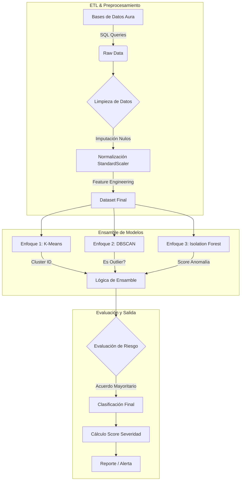

# Reporte de Actividad: Sistema de Clustering para Detección de Riesgos en Aura

Este documento detalla el diseño e implementación de un sistema de clustering para identificar usuarios en riesgo de aislamiento social y problemas emocionales en la plataforma Aura.

---

## 1. Selección de Variables y Justificación

Para el sistema de clustering, hemos seleccionado las siguientes variables clave basándonos en la documentación de `data_mining_social_isolation.md`. Estas variables cubren las dimensiones de actividad, conexión social y estado emocional.

| Variable | Fuente | Justificación |
| :--- | :--- | :--- |
| **`amigos_reales`** | `friendships` | **Indicador directo de red de apoyo.** Un número bajo (cercano a 0) es el predictor más fuerte de aislamiento social estructural. |
| **`conversaciones_activas`** | `conversaciones` | **Indicador de interacción íntima.** Diferencia entre tener "seguidores" y tener conexiones humanas reales. La falta de conversaciones privadas sugiere soledad emocional. |
| **`dias_inactividad`** | `user_profiles` | **Indicador de retraimiento.** Un aumento progresivo en la inactividad suele preceder al abandono de la plataforma y puede correlacionarse con episodios depresivos (anhedonia). |
| **`engagement_promedio`** | `posts` | **Indicador de integración social.** Mide si el usuario recibe feedback de su entorno. Un engagement bajo puede reforzar sentimientos de invisibilidad o rechazo. |
| **`ratio_reciprocidad`** | Derivada | **Indicador de equilibrio en relaciones.** Detecta comportamientos unidireccionales (ej. buscar atención sin recibirla o aislarse a pesar de ser buscado). |
| **`sentimiento_promedio`** | NLP (Posts) | **Indicador de estado de ánimo.** Variable cualitativa transformada a cuantitativa que permite detectar disforia o negatividad persistente. |
| **`variabilidad_horaria`** | `posts` | **Indicador de patrones de sueño/rutina.** Actividad errática o nocturna puede señalar trastornos del sueño asociados a ansiedad/depresión. |

---

## 2. Métricas y Métodos de Correlación

### ¿Qué métricas deben priorizar según su problema?

Dado que el objetivo es la **detección temprana de riesgos (salud mental)**, la prioridad debe ser minimizar los Falsos Negativos (no detectar a alguien que sí está en riesgo).

1.  **Recall (Sensibilidad)**: **PRIORIDAD MÁXIMA**. Es preferible que el sistema marque a un usuario sano como "en riesgo" (Falso Positivo, que se descarta tras revisión) a que ignore a un usuario en crisis (Falso Negativo).
2.  **F1-Score**: Para mantener un balance aceptable y no saturar al equipo de intervención con falsas alarmas.
3.  **Silhouette Score**: Para evaluar la calidad técnica de la separación de los clusters, asegurando que los grupos de "riesgo" sean distintos de los usuarios "normales".

### ¿Cuál método parece más sensible a las correlaciones en este caso? ¿Por qué?

**Recomendación: Mutual Information (Información Mutua)**

*   **Por qué**: El comportamiento humano y los indicadores de salud mental **rara vez son lineales**. Por ejemplo, tener *cero* amigos es malo, pero tener *demasiados* (miles) no necesariamente significa "mejor" salud mental (puede ser superficialidad). La Correlación de Pearson fallaría aquí.
*   **Sensibilidad**: Mutual Information detecta cualquier tipo de dependencia estadística (lineal o no lineal) y funciona bien con variables mixtas (continuas como `dias_inactividad` y discretas/categóricas como `nivel_riesgo`).
*   **Alternativa**: **Spearman** es una buena segunda opción para relaciones monótonas (ej. a menos amigos, más riesgo), siendo más robusto a outliers que Pearson.

---

## 3. Diagrama de Flujo del Sistema

El siguiente diagrama ilustra el flujo de datos desde la extracción hasta la generación de alertas mediante los modelos ensamblados.



---

## 4. Diseño de Modelos Ensamblados (3 Enfoques)

Para aumentar la robustez de la detección, proponemos dos estrategias de ensamblaje utilizando tres algoritmos distintos: **K-Means** (basado en centroides), **DBSCAN** (basado en densidad) e **Isolation Forest** (basado en aislamiento).

### Enfoque 1: Ensamble de Votación (Voting Ensemble)

Este modelo ejecuta los tres algoritmos en paralelo y toma una decisión basada en "votos". Es ideal para reducir la varianza y evitar sesgos de un solo algoritmo.

*   **Algoritmo A (K-Means)**: Divide usuarios en $k=4$ clusters. Si el usuario cae en el cluster de "centroides de bajo engagement/pocos amigos", vota **RIESGO**.
*   **Algoritmo B (DBSCAN)**: Busca outliers en zonas de baja densidad. Si el usuario es marcado como ruido (-1), vota **RIESGO**.
*   **Algoritmo C (Isolation Forest)**: Asigna un score de anomalía. Si el score < umbral (ej. -0.5), vota **RIESGO**.

**Regla de Decisión**:
*   Si **Votos >= 2**: Se marca como **ALTO RIESGO**.
*   Si **Votos == 1**: Se marca como **RIESGO MODERADO** (Revisión).
*   Si **Votos == 0**: **BAJO RIESGO**.

### Enfoque 2: Ensamble Jerárquico (Cascading Filter)

Este modelo funciona como un embudo para filtrar falsos positivos y categorizar con mayor precisión.

1.  **Nivel 1 (K-Means)**: Se utiliza como filtro grueso para separar a la población general de los casos potenciales.
    *   *Entrada*: Todos los usuarios.
    *   *Acción*: Los usuarios en clusters "Normales" se descartan. Los usuarios en clusters "Sospechosos" pasan al Nivel 2.
2.  **Nivel 2 (Isolation Forest)**: Analiza la severidad de los casos sospechosos.
    *   *Entrada*: Usuarios filtrados del Nivel 1.
    *   *Acción*: Calcula el *Anomaly Score*. Los que tienen scores muy extremos pasan al Nivel 3 como "Anomalías Críticas".
3.  **Nivel 3 (DBSCAN)**: Contextualiza la anomalía.
    *   *Entrada*: Anomalías Críticas.
    *   *Acción*: Verifica si es un caso aislado (Outlier puro) o si forma parte de un micro-cluster de comportamiento patológico (ej. un grupo de usuarios con comportamiento autodestructivo similar).

---

## 5. Implementación en Python

A continuación se presenta el código para implementar el **Ensamble de Votación** descrito anteriormente.

```python
import pandas as pd
import numpy as np
from sklearn.preprocessing import StandardScaler
from sklearn.cluster import KMeans, DBSCAN
from sklearn.ensemble import IsolationForest
from sklearn.metrics import silhouette_score

class AuraRiskEnsemble:
    def __init__(self, data):
        self.raw_data = data
        self.scaler = StandardScaler()
        self.X_scaled = None
        self.results = pd.DataFrame()

    def preprocess(self):
        # Selección de features clave
        features = [
            'amigos_reales', 'conversaciones_activas', 'dias_inactividad',
            'engagement_promedio', 'ratio_reciprocidad', 'sentimiento_promedio'
        ]
        # Rellenar nulos con 0 o media según corresponda
        X = self.raw_data[features].fillna(0)
        self.X_scaled = self.scaler.fit_transform(X)
        self.results = self.raw_data[['user_id']].copy()

    def run_kmeans(self, n_clusters=4):
        # Enfoque 1: K-Means
        kmeans = KMeans(n_clusters=n_clusters, random_state=42, n_init=10)
        clusters = kmeans.fit_predict(self.X_scaled)
        
        # Identificar cluster de riesgo (el que tenga menor promedio de amigos/interacciones)
        centers = kmeans.cluster_centers_
        # Asumimos que la feature 0 es 'amigos_reales' (normalizada)
        risk_cluster_idx = np.argmin(centers[:, 0]) 
        
        self.results['kmeans_cluster'] = clusters
        self.results['vote_kmeans'] = (clusters == risk_cluster_idx).astype(int)
        print(f"K-Means: Cluster de riesgo identificado es {risk_cluster_idx}")

    def run_dbscan(self, eps=0.5, min_samples=5):
        # Enfoque 2: DBSCAN (Detección de outliers)
        dbscan = DBSCAN(eps=eps, min_samples=min_samples)
        clusters = dbscan.fit_predict(self.X_scaled)
        
        # -1 indica outlier en DBSCAN
        self.results['dbscan_cluster'] = clusters
        self.results['vote_dbscan'] = (clusters == -1).astype(int)

    def run_isolation_forest(self, contamination=0.05):
        # Enfoque 3: Isolation Forest
        iso = IsolationForest(contamination=contamination, random_state=42)
        preds = iso.fit_predict(self.X_scaled)
        # -1 es anomalía, 1 es normal
        scores = iso.decision_function(self.X_scaled)
        
        self.results['iso_pred'] = preds
        self.results['iso_score'] = scores # Score negativo = más anómalo
        self.results['vote_iso'] = (preds == -1).astype(int)

    def calculate_ensemble_risk(self):
        # Suma de votos
        self.results['total_votes'] = (
            self.results['vote_kmeans'] + 
            self.results['vote_dbscan'] + 
            self.results['vote_iso']
        )
        
        # Clasificación final
        conditions = [
            (self.results['total_votes'] >= 2),
            (self.results['total_votes'] == 1)
        ]
        choices = ['ALTO RIESGO', 'RIESGO MODERADO']
        self.results['risk_level'] = np.select(conditions, choices, default='BAJO RIESGO')
        
        return self.results

    def calculate_anomaly_severity(self):
        # Métrica combinada de severidad (0 a 100)
        # Normalizamos el score de Isolation Forest (que suele ir de -0.5 a 0.5 aprox)
        # Cuanto más negativo, más anómalo. Invertimos para que mayor sea más severo.
        
        iso_score = self.results['iso_score']
        min_score = iso_score.min()
        max_score = iso_score.max()
        
        # Normalización Min-Max invertida
        severity = 100 * (1 - (iso_score - min_score) / (max_score - min_score))
        
        # Ajuste: Si DBSCAN también dice que es outlier, aumentamos severidad un 20%
        severity = np.where(self.results['vote_dbscan'] == 1, severity * 1.2, severity)
        
        # Cap en 100
        self.results['anomaly_severity_index'] = np.clip(severity, 0, 100)
        
        return self.results[['user_id', 'risk_level', 'anomaly_severity_index']]

# Ejemplo de uso (simulado)
# data = pd.read_csv('features.csv')
# system = AuraRiskEnsemble(data)
# system.preprocess()
# system.run_kmeans()
# system.run_dbscan()
# system.run_isolation_forest()
# system.calculate_ensemble_risk()
# print(system.calculate_anomaly_severity().head())
```

---

## 6. Métrica de Severidad de Anomalía

Para determinar **qué tan anómalo** es un punto muestral (usuario) y priorizar la intervención, definimos el **Índice de Severidad de Anomalía (ASI)**.

### Definición
El ASI es un valor numérico continuo (0-100) que indica la magnitud de la desviación del comportamiento del usuario respecto a la norma.

### Fórmula Propuesta
$$ ASI = w_1 \cdot (1 - S_{iso}) + w_2 \cdot I_{dbscan} + w_3 \cdot D_{kmeans} $$

Donde:
*   $S_{iso}$: Score normalizado de Isolation Forest (0 a 1, donde 1 es muy normal).
*   $I_{dbscan}$: Variable binaria (1 si es outlier en DBSCAN, 0 si no).
*   $D_{kmeans}$: Distancia del usuario al centroide de su cluster (normalizada), penalizando si pertenece a un cluster de riesgo.
*   $w_1, w_2, w_3$: Pesos ponderados (ej. 0.5, 0.3, 0.2).

### Consideraciones para calcular este número

1.  **Normalización Robusta**: Las variables de entrada (amigos, mensajes) tienen escalas muy diferentes. Es crítico usar `RobustScaler` o `StandardScaler` antes de calcular distancias o scores, para que una variable con varianza alta no domine el cálculo.
2.  **Manejo de "Ceros"**: En aislamiento social, el "0" (0 amigos, 0 mensajes) es un valor significativo, no un dato faltante. El modelo debe interpretar el 0 como un valor extremo en el contexto negativo.
3.  **Calibración Temporal**: La severidad debe ponderarse por el tiempo. Una anomalía detectada hoy es más severa si el usuario ha mostrado una pendiente negativa (decaimiento) en los últimos 30 días (`ratio_decay`).
4.  **Validación Humana**: Los umbrales para definir "Severidad Alta" (>80, por ejemplo) deben ajustarse iterativamente con feedback del equipo de psicólogos para asegurar que el número refleje urgencia clínica real.
