# Sistema de Minería de Datos: Detección de Aislamiento Social y Problemas Emocionales

## 📋 Objetivo del Proyecto

Diseñar e implementar un **sistema de clustering y análisis predictivo** para identificar usuarios jóvenes en riesgo de:
- **Aislamiento social**
- **Abuso de sustancias**
- **Problemas emocionales** (depresión, ansiedad, conductas autodestructivas)
- **Deterioro en salud mental**

El sistema debe ser **proactivo y preventivo**, permitiendo intervenciones tempranas antes de que las situaciones se agraven.

---

## 🎯 Variables de Entrada Identificadas

### 1. Variables de Actividad Social (Social-Service)

#### 1.1 Métricas de Conexión Social
```sql
-- Variables extraíbles de user_profiles
SELECT 
    user_id,
    followers_count,                    -- Número de seguidores
    following_count,                    -- Número de usuarios seguidos
    posts_count,                        -- Actividad de publicación
    DATEDIFF(NOW(), last_active_at) AS dias_inactividad,
    is_verified,
    is_active
FROM user_profiles;
```

**Indicadores de riesgo:**
- `followers_count < 5`: Muy pocas conexiones sociales
- `following_count < 3`: Poco interés en conectar con otros
- `posts_count = 0` o muy bajo: Falta de expresión/participación
- `dias_inactividad > 30`: Abandono de la plataforma

#### 1.2 Red de Amistades
```sql
-- Análisis de friendships
SELECT 
    f.requester_id AS user_id,
    COUNT(CASE WHEN f.status = 'accepted' THEN 1 END) AS amigos_reales,
    COUNT(CASE WHEN f.status = 'pending' THEN 1 END) AS solicitudes_pendientes,
    COUNT(CASE WHEN f.status = 'rejected' THEN 1 END) AS rechazos,
    COUNT(CASE WHEN f.status = 'blocked' THEN 1 END) AS bloqueos,
    AVG(DATEDIFF(f.responded_at, f.requested_at)) AS tiempo_promedio_respuesta
FROM friendships f
WHERE f.is_active = true
GROUP BY f.requester_id;
```

**Indicadores de riesgo:**
- `amigos_reales = 0`: Sin red de apoyo
- `rechazos / solicitudes_totales > 0.5`: Dificultad para conectar
- `bloqueos > 0`: Conflictos interpersonales

#### 1.3 Participación en Comunidades
```sql
-- Engagement en comunidades
SELECT 
    cm.user_id,
    COUNT(DISTINCT cm.community_id) AS num_comunidades,
    GROUP_CONCAT(c.category) AS categorias_interes,
    AVG(c.members_count) AS tamano_promedio_comunidad,
    MIN(cm.joined_at) AS primera_union,
    MAX(cm.joined_at) AS ultima_union
FROM community_members cm
JOIN communities c ON cm.community_id = c.id
GROUP BY cm.user_id;
```

**Indicadores de riesgo:**
- `num_comunidades = 0`: Falta de pertenencia grupal
- Abandono de comunidades: `ultima_union` muy antigua
- Solo comunidades muy grandes: Falta de grupos íntimos

### 2. Variables de Comportamiento de Contenido

#### 2.1 Análisis de Publicaciones
```sql
-- Patrones de publicación
SELECT 
    p.user_id,
    COUNT(*) AS total_posts,
    AVG(p.likes_count) AS promedio_likes,
    AVG(p.comments_count) AS promedio_comentarios,
    AVG(p.likes_count + p.comments_count) AS engagement_promedio,
    SUM(CASE WHEN p.visibility = 'private' THEN 1 ELSE 0 END) AS posts_privados,
    SUM(CASE WHEN p.visibility = 'public' THEN 1 ELSE 0 END) AS posts_publicos,
    STDDEV(DATEDIFF(NOW(), p.created_at)) AS variabilidad_publicacion,
    MAX(p.created_at) AS ultima_publicacion,
    MIN(p.created_at) AS primera_publicacion
FROM posts p
WHERE p.is_active = true
GROUP BY p.user_id;
```

**Indicadores de riesgo:**
- `engagement_promedio < 2`: Contenido que no genera interacción
- `posts_privados / total_posts > 0.7`: Tendencia al aislamiento
- `DATEDIFF(NOW(), ultima_publicacion) > 60`: Silencio prolongado
- `variabilidad_publicacion` muy alta: Comportamiento errático

#### 2.2 Análisis Semántico de Contenido (NLP)
```sql
-- Extracción de contenido textual para análisis
SELECT 
    user_id,
    content,
    created_at,
    likes_count,
    comments_count
FROM posts
WHERE content IS NOT NULL AND content != '';
```

**Procesamiento con NLP:**
- **Análisis de sentimiento**: Detectar negatividad, desesperanza, tristeza
- **Detección de palabras clave**: 
  - Palabras relacionadas con sustancias: "alcohol", "drogas", "fumar", etc.
  - Palabras de desesperanza: "solo", "nadie", "vacío", "sin sentido"
  - Expresiones de autolesión: "no quiero vivir", "terminar con todo"
- **Frecuencia de emojis negativos**: 😢, 😭, 💔, 😞
- **Topic modeling**: Identificar temas recurrentes (soledad, problemas familiares)

### 3. Variables de Interacción Social

#### 3.1 Comentarios Recibidos y Dados
```sql
-- Análisis de comentarios
SELECT 
    c.user_id,
    COUNT(*) AS comentarios_realizados,
    AVG(c.likes_count) AS likes_promedio_en_comentarios,
    SUM(CASE WHEN c.is_edited THEN 1 ELSE 0 END) AS comentarios_editados,
    COUNT(DISTINCT c.post_id) AS posts_comentados
FROM comments c
WHERE c.is_active = true
GROUP BY c.user_id;

-- Comentarios RECIBIDOS (en posts del usuario)
SELECT 
    p.user_id,
    COUNT(c.id) AS comentarios_recibidos,
    COUNT(DISTINCT c.user_id) AS usuarios_comentadores
FROM posts p
LEFT JOIN comments c ON p.id = c.post_id
GROUP BY p.user_id;
```

**Indicadores de riesgo:**
- `comentarios_realizados = 0`: Falta de participación conversacional
- `comentarios_recibidos < 3`: Poco feedback de otros
- `usuarios_comentadores < 2`: Muy poca interacción bidireccional

#### 3.2 Reacciones (Likes)
```sql
-- Análisis de likes dados y recibidos
SELECT 
    l.user_id,
    COUNT(*) AS likes_dados,
    SUM(CASE WHEN l.type = 'like' THEN 1 ELSE 0 END) AS likes_positivos,
    SUM(CASE WHEN l.type IN ('angry', 'sad') THEN 1 ELSE 0 END) AS reacciones_negativas,
    COUNT(DISTINCT l.likeable_id) AS contenido_likeado
FROM likes l
GROUP BY l.user_id;
```

**Indicadores de riesgo:**
- `likes_dados / dias_en_plataforma < 0.5`: Muy poca interacción
- `reacciones_negativas / likes_dados > 0.3`: Sesgo hacia contenido negativo

### 4. Variables de Comunicación (Messaging-Service)

#### 4.1 Conversaciones Privadas
```sql
-- Análisis de conversaciones 1:1
SELECT 
    participant1_profile_id AS user_id,
    COUNT(DISTINCT c.id) AS conversaciones_activas,
    AVG(c.unread_count_1) AS mensajes_sin_leer_promedio,
    SUM(CASE WHEN c.participant1_status = 'archived' THEN 1 ELSE 0 END) AS conversaciones_archivadas,
    SUM(CASE WHEN c.participant1_status = 'blocked' THEN 1 ELSE 0 END) AS usuarios_bloqueados,
    AVG(DATEDIFF(NOW(), c.last_message_at)) AS dias_desde_ultimo_mensaje
FROM conversations c
GROUP BY participant1_profile_id

UNION ALL

SELECT 
    participant2_profile_id AS user_id,
    COUNT(DISTINCT c.id),
    AVG(c.unread_count_2),
    SUM(CASE WHEN c.participant2_status = 'archived' THEN 1 ELSE 0 END),
    SUM(CASE WHEN c.participant2_status = 'blocked' THEN 1 ELSE 0 END),
    AVG(DATEDIFF(NOW(), c.last_message_at))
FROM conversations c
GROUP BY participant2_profile_id;
```

**Indicadores de riesgo:**
- `conversaciones_activas < 2`: Muy pocas conexiones privadas
- `usuarios_bloqueados > 3`: Conflictos interpersonales frecuentes
- `dias_desde_ultimo_mensaje > 30`: Desconexión comunicativa

#### 4.2 Mensajes Enviados/Recibidos
```sql
-- Análisis de mensajes
SELECT 
    m.sender_profile_id AS user_id,
    COUNT(*) AS mensajes_enviados,
    AVG(CHAR_LENGTH(m.content)) AS longitud_promedio_mensaje,
    SUM(CASE WHEN m.is_edited THEN 1 ELSE 0 END) AS mensajes_editados,
    SUM(CASE WHEN m.is_deleted THEN 1 ELSE 0 END) AS mensajes_eliminados,
    SUM(CASE WHEN m.status = 'read' THEN 1 ELSE 0 END) / COUNT(*) AS tasa_lectura
FROM messages m
WHERE m.is_deleted = false
GROUP BY m.sender_profile_id;
```

**Indicadores de riesgo:**
- `mensajes_enviados / dias_activo < 1`: Comunicación muy baja
- `tasa_lectura < 0.3`: Mensajes ignorados (posible rechazo social)
- `mensajes_eliminados / mensajes_enviados > 0.2`: Arrepentimiento comunicativo

#### 4.3 Participación en Grupos
```sql
-- Análisis de participación en grupos de chat
SELECT 
    gm.profile_id AS user_id,
    COUNT(DISTINCT gm.group_id) AS grupos_unidos,
    AVG(gm.unread_count) AS mensajes_no_leidos_promedio,
    SUM(CASE WHEN gm.is_muted THEN 1 ELSE 0 END) AS grupos_silenciados,
    AVG(DATEDIFF(NOW(), gm.last_read_at)) AS dias_sin_leer_grupo
FROM group_members gm
GROUP BY gm.profile_id;
```

**Indicadores de riesgo:**
- `grupos_unidos = 0`: Sin pertenencia grupal
- `grupos_silenciados / grupos_unidos > 0.7`: Evitación de interacción grupal

### 5. Variables Temporales (Patrones de Actividad)

#### 5.1 Frecuencia de Actividad
```sql
-- Distribución temporal de actividad
SELECT 
    up.user_id,
    COUNT(DISTINCT DATE(p.created_at)) AS dias_con_actividad,
    DATEDIFF(NOW(), up.created_at) AS dias_totales_en_plataforma,
    COUNT(DISTINCT DATE(p.created_at)) / DATEDIFF(NOW(), up.created_at) AS ratio_actividad_diaria,
    STDDEV(HOUR(p.created_at)) AS variabilidad_horaria,
    HOUR(MIN(p.created_at)) AS hora_primera_actividad,
    HOUR(MAX(p.created_at)) AS hora_ultima_actividad
FROM user_profiles up
LEFT JOIN posts p ON up.user_id = p.user_id
GROUP BY up.user_id;
```

**Indicadores de riesgo:**
- `ratio_actividad_diaria < 0.1`: Uso muy esporádico
- Actividad solo en horas nocturnas (2-6 AM): Posible insomnio/depresión
- `variabilidad_horaria` muy baja: Comportamiento rígido/compulsivo

#### 5.2 Decaimiento de Actividad (Churn)
```sql
-- Tendencia de actividad en ventanas temporales
SELECT 
    user_id,
    COUNT(CASE WHEN created_at >= DATE_SUB(NOW(), INTERVAL 7 DAY) THEN 1 END) AS posts_ultima_semana,
    COUNT(CASE WHEN created_at >= DATE_SUB(NOW(), INTERVAL 30 DAY) THEN 1 END) AS posts_ultimo_mes,
    COUNT(CASE WHEN created_at >= DATE_SUB(NOW(), INTERVAL 90 DAY) THEN 1 END) AS posts_ultimo_trimestre,
    -- Ratio de decaimiento
    COUNT(CASE WHEN created_at >= DATE_SUB(NOW(), INTERVAL 7 DAY) THEN 1 END) /
    NULLIF(COUNT(CASE WHEN created_at >= DATE_SUB(NOW(), INTERVAL 30 DAY) THEN 1 END), 0) AS ratio_decay
FROM posts
GROUP BY user_id;
```

**Indicadores de riesgo:**
- `ratio_decay < 0.2`: Decaimiento drástico en actividad
- Caída abrupta después de un periodo activo: Posible evento traumático

### 6. Variables Demográficas y de Perfil

#### 6.1 Información Personal
```sql
-- Datos demográficos
SELECT 
    cp.user_id,
    cp.age,
    YEAR(NOW()) - YEAR(up.birth_date) AS edad_calculada,
    up.gender,
    up.location,
    CHAR_LENGTH(up.bio) AS longitud_bio,
    CHAR_LENGTH(cp.bio) AS longitud_bio_completa,
    JSON_LENGTH(cp.hobbies) AS cantidad_hobbies
FROM complete_profiles cp
JOIN user_profiles up ON cp.user_id = up.user_id;
```

**Indicadores de riesgo:**
- `age BETWEEN 13 AND 25`: Población de mayor riesgo
- `longitud_bio = 0`: Falta de auto-expresión
- `cantidad_hobbies = 0`: Falta de intereses

#### 6.2 Preferencias e Intereses
```sql
-- Análisis de preferencias
SELECT 
    up.user_id,
    JSON_LENGTH(up.preferences) AS num_preferencias,
    GROUP_CONCAT(DISTINCT i.category) AS categorias_interes,
    COUNT(DISTINCT i.id) AS intereses_declarados
FROM user_preferences up
LEFT JOIN interests i ON up.user_id = i.user_id
GROUP BY up.user_id;
```

**Indicadores de riesgo:**
- `num_preferencias < 2`: Falta de intereses definidos
- `intereses_declarados = 0`: Apatía/anhedonia

### 7. Variables Derivadas (Feature Engineering)

#### 7.1 Índice de Aislamiento Social (IAS)
```sql
-- Fórmula compuesta
SELECT 
    user_id,
    (
        CASE WHEN amigos_reales = 0 THEN 10 ELSE 10 / LOG(amigos_reales + 1) END +
        CASE WHEN conversaciones_activas = 0 THEN 10 ELSE 10 / LOG(conversaciones_activas + 1) END +
        CASE WHEN num_comunidades = 0 THEN 10 ELSE 10 / LOG(num_comunidades + 1) END +
        (100 - engagement_promedio) / 10 +
        LEAST(dias_inactividad / 10, 10)
    ) / 5 AS indice_aislamiento_social
FROM user_metrics;
```

**Escala:** 0-10  
- 0-3: Bajo riesgo
- 3-6: Riesgo moderado
- 6-10: Alto riesgo

#### 7.2 Score de Reciprocidad Social
```sql
-- Mide si las interacciones son bidireccionales
SELECT 
    user_id,
    (comentarios_recibidos / NULLIF(comentarios_realizados, 0)) AS ratio_reciprocidad_comentarios,
    (mensajes_recibidos / NULLIF(mensajes_enviados, 0)) AS ratio_reciprocidad_mensajes,
    (solicitudes_aceptadas / NULLIF(solicitudes_enviadas, 0)) AS ratio_reciprocidad_amistades
FROM interaction_metrics;
```

**Indicadores de riesgo:**
- `ratio_reciprocidad < 0.3`: Relaciones unidireccionales (dar sin recibir)
- `ratio_reciprocidad > 3.0`: Relaciones parasitarias (recibir sin dar)

#### 7.3 Índice de Variabilidad Emocional
- Análisis de sentimiento en posts a lo largo del tiempo
- Identificar oscilaciones bruscas (posible bipolaridad o crisis)
- Tendencia descendente sostenida (posible depresión)

---

## 📊 Métricas Priorizadas según el Problema

### Problema: **Aislamiento Social**

| Métrica | Prioridad | Justificación |
|---------|-----------|---------------|
| Número de amistades aceptadas | 🔴 Crítica | Directamente mide red de apoyo |
| Conversaciones activas | 🔴 Crítica | Comunicación privada es indicador clave |
| Participación en comunidades | 🟠 Alta | Sentido de pertenencia |
| Días de inactividad | 🟠 Alta | Desconexión paulatina |
| Engagement en posts | 🟡 Media | Refleja interacción pública |
| Mensajes enviados/recibidos | 🟡 Media | Nivel de comunicación |

### Problema: **Abuso de Sustancias**

| Métrica | Prioridad | Justificación |
|---------|-----------|---------------|
| Análisis NLP de contenido | 🔴 Crítica | Detección de menciones explícitas |
| Cambios abruptos de comportamiento | 🔴 Crítica | Posible indicador de consumo |
| Actividad en horas nocturnas | 🟠 Alta | Patrón asociado a consumo |
| Abandono de comunidades positivas | 🟠 Alta | Desconexión de influencias saludables |
| Incremento de reacciones negativas | 🟡 Media | Estado emocional deteriorado |
| Mensajes incoherentes/editados | 🟡 Media | Posible deterioro cognitivo |

### Problema: **Problemas Emocionales (Depresión/Ansiedad)**

| Métrica | Prioridad | Justificación |
|---------|-----------|---------------|
| Análisis de sentimiento (NLP) | 🔴 Crítica | Detecta negatividad/desesperanza |
| Decaimiento de actividad | 🔴 Crítica | Apatía/anhedonia |
| Likes recibidos vs enviados | 🟠 Alta | Falta de refuerzo social |
| Posts privados vs públicos | 🟠 Alta | Retraimiento social |
| Longitud de bio/auto-descripción | 🟡 Media | Auto-percepción |
| Variabilidad horaria de actividad | 🟡 Media | Insomnio/alteración circadiana |

---

## 📈 KPIs del Sistema de Detección

### KPIs de Cobertura
1. **% de usuarios evaluados**: Meta > 95%
2. **Frecuencia de evaluación**: Semanal para usuarios activos, mensual para inactivos
3. **Latencia de detección**: Tiempo desde señal de alarma hasta clasificación < 24h

### KPIs de Precisión
4. **Tasa de detección (Recall)**: > 85% de casos reales identificados
5. **Precisión (Precision)**: > 70% de alertas son verdaderos positivos
6. **F1-Score**: > 0.75 (balance entre precisión y recall)
7. **AUC-ROC**: > 0.80 (capacidad discriminativa del modelo)

### KPIs de Intervención
8. **Tiempo de respuesta**: < 12h desde alerta hasta contacto inicial
9. **Tasa de aceptación de ayuda**: > 40% de usuarios contactados aceptan intervención
10. **Tasa de mejora**: > 60% de usuarios muestran mejora en 30 días post-intervención

### KPIs de Impacto
11. **Reducción de churn**: % de usuarios en riesgo que permanecen activos
12. **Incremento de conexiones sociales**: Promedio de nuevas amistades en 60 días
13. **Mejora en sentimiento**: Cambio positivo en análisis NLP

---

## 🔬 Métodos de Correlación y Análisis

### ¿Cuál método es más sensible a las correlaciones?

#### 1. **Análisis de Correlación de Pearson**
```python
import pandas as pd
from scipy.stats import pearsonr

# Correlación entre variables continuas
correlacion, p_valor = pearsonr(df['amigos_reales'], df['engagement_promedio'])
```

**Ventajas:**
- Detecta relaciones lineales
- Fácil interpretación (-1 a 1)
- Computacionalmente eficiente

**Limitaciones:**
- Solo relaciones lineales
- Sensible a outliers
- Asume normalidad

**Uso recomendado:** Análisis exploratorio inicial

#### 2. **Correlación de Spearman (NO PARAMÉTRICA)**
```python
from scipy.stats import spearmanr

# Correlación basada en rangos
correlacion, p_valor = spearmanr(df['dias_inactividad'], df['indice_aislamiento'])
```

**Ventajas:**
- ✅ **MÁS SENSIBLE** a relaciones monotónicas no lineales
- Robusta ante outliers
- No asume distribución normal
- Funciona con variables ordinales

**Limitaciones:**
- Menos intuitiva que Pearson
- Pierde información al convertir a rangos

**Uso recomendado:** Variables con distribuciones asimétricas o relaciones no lineales

#### 3. **Mutual Information (Información Mutua)**
```python
from sklearn.feature_selection import mutual_info_classif

# Detecta dependencias no lineales
mi_scores = mutual_info_classif(X, y, random_state=42)
```

**Ventajas:**
- ✅ **MÁS SENSIBLE** a relaciones complejas (no solo monotónicas)
- Detecta dependencias no lineales
- No asume tipo de relación
- Funciona con variables categóricas

**Limitaciones:**
- Requiere más datos
- Computacionalmente costosa
- No da dirección de la relación

**Uso recomendado:** Feature selection para modelos de ML

#### 4. **Random Forest Feature Importance**
```python
from sklearn.ensemble import RandomForestClassifier

rf = RandomForestClassifier(n_estimators=100)
rf.fit(X_train, y_train)
importancias = rf.feature_importances_
```

**Ventajas:**
- ✅ **MÁS SENSIBLE** a interacciones entre variables
- Captura relaciones no lineales complejas
- Maneja bien datos desbalanceados
- Robusto ante outliers

**Limitaciones:**
- No da correlación directa
- Puede sobreestimar variables con muchas categorías
- Requiere modelo entrenado

**Uso recomendado:** Identificar variables más predictivas

### **Recomendación para este proyecto:**

**Enfoque híbrido en 3 fases:**

1. **Fase Exploratoria**: Spearman + Mutual Information
   - Identificar todas las relaciones significativas
   - No asumir linealidad en comportamientos humanos

2. **Fase de Selección de Features**: Random Forest Importance
   - Detectar interacciones complejas
   - Ejemplo: "baja actividad" + "pocas amistades" → alto riesgo

3. **Fase de Validación**: Análisis de Componentes Principales (PCA)
   - Reducir dimensionalidad manteniendo varianza
   - Visualizar clusters naturales

---

## 🧩 Implementaciones Sugeridas de Clustering

### Sistema 1: **K-Means Clustering para Segmentación de Riesgo**

#### Arquitectura
```python
from sklearn.cluster import KMeans
from sklearn.preprocessing import StandardScaler
from sklearn.decomposition import PCA
import pandas as pd

# 1. Preparación de datos
features = [
    'amigos_reales', 'conversaciones_activas', 'num_comunidades',
    'engagement_promedio', 'dias_inactividad', 'posts_count',
    'mensajes_enviados', 'ratio_reciprocidad', 'indice_aislamiento'
]

X = df[features].fillna(0)

# 2. Normalización (CRÍTICO para K-Means)
scaler = StandardScaler()
X_scaled = scaler.fit_transform(X)

# 3. Determinar K óptimo (Método del codo)
inertias = []
K_range = range(2, 11)
for k in K_range:
    kmeans = KMeans(n_clusters=k, random_state=42, n_init=10)
    kmeans.fit(X_scaled)
    inertias.append(kmeans.inertia_)

# 4. Entrenar modelo final
optimal_k = 4  # Ejemplo: Bajo, Moderado, Alto, Crítico
kmeans = KMeans(n_clusters=optimal_k, random_state=42)
df['cluster_riesgo'] = kmeans.fit_predict(X_scaled)

# 5. Interpretación de clusters
cluster_profiles = df.groupby('cluster_riesgo')[features].mean()
print(cluster_profiles)
```

#### Interpretación de Clusters Sugerida
- **Cluster 0 - Bajo Riesgo**: Alta conectividad, actividad regular, buena reciprocidad
- **Cluster 1 - Riesgo Moderado**: Actividad irregular, algunas conexiones, engagement bajo
- **Cluster 2 - Alto Riesgo**: Pocas conexiones, inactividad prolongada, bajo engagement
- **Cluster 3 - Riesgo Crítico**: Aislamiento extremo, sin actividad, señales de crisis

#### Ventajas
- ✅ Rápido y escalable
- ✅ Fácil interpretación
- ✅ Actualizaciones en tiempo real

#### Limitaciones
- ⚠️ Asume clusters esféricos
- ⚠️ Sensible a la escala de variables
- ⚠️ K debe ser definido a priori

---

### Sistema 2: **DBSCAN para Detección de Anomalías**

#### Arquitectura
```python
from sklearn.cluster import DBSCAN

# DBSCAN no requiere especificar número de clusters
# Detecta outliers automáticamente

dbscan = DBSCAN(eps=0.5, min_samples=10, metric='euclidean')
df['cluster_dbscan'] = dbscan.fit_predict(X_scaled)

# Usuarios marcados como -1 son outliers (ALTO RIESGO)
outliers = df[df['cluster_dbscan'] == -1]
print(f"Usuarios en situación anómala: {len(outliers)}")
```

#### Ventajas
- ✅ **Ideal para detectar casos extremos** (usuarios en crisis)
- ✅ No requiere K predefinido
- ✅ Robusto ante outliers
- ✅ Detecta clusters de forma irregular

#### Limitaciones
- ⚠️ Parámetros eps y min_samples requieren tuning
- ⚠️ Difícil con dimensiones altas
- ⚠️ Sensible a densidad variable

#### Uso recomendado
**Sistema de alerta temprana:** Identificar usuarios con comportamientos atípicos que no encajan en ningún patrón normal.

---

### Sistema 3: **Hierarchical Clustering para Taxonomía de Perfiles**

#### Arquitectura
```python
from scipy.cluster.hierarchy import dendrogram, linkage, fcluster
import matplotlib.pyplot as plt

# 1. Calcular matriz de distancias
linkage_matrix = linkage(X_scaled, method='ward')

# 2. Visualizar dendrograma
plt.figure(figsize=(12, 8))
dendrogram(linkage_matrix, truncate_mode='lastp', p=30)
plt.title('Dendrograma de Usuarios')
plt.xlabel('Índice de Usuario')
plt.ylabel('Distancia')
plt.show()

# 3. Cortar árbol en clusters
df['cluster_jerarquico'] = fcluster(linkage_matrix, t=4, criterion='maxclust')
```

#### Ventajas
- ✅ Visualización intuitiva (dendrograma)
- ✅ No requiere K a priori
- ✅ Permite taxonomía multinivel (sub-clusters)

#### Limitaciones
- ⚠️ Computacionalmente costoso (O(n²))
- ⚠️ No escalable para >10,000 usuarios
- ⚠️ Decisión de corte del árbol subjetiva

#### Uso recomendado
**Análisis exploratorio y reportes:** Crear perfiles detallados de tipos de usuarios en riesgo.

---

### Sistema 4: **Gaussian Mixture Models (GMM) - Clustering Probabilístico**

#### Arquitectura
```python
from sklearn.mixture import GaussianMixture

# GMM asigna probabilidades de pertenencia a cada cluster
gmm = GaussianMixture(n_components=4, covariance_type='full', random_state=42)
df['cluster_gmm'] = gmm.fit_predict(X_scaled)

# Probabilidades de pertenencia
probs = gmm.predict_proba(X_scaled)
df['prob_alto_riesgo'] = probs[:, 2]  # Probabilidad de cluster de alto riesgo
```

#### Ventajas
- ✅ **Asignación probabilística** (no binaria)
- ✅ Permite identificar usuarios en "zona gris"
- ✅ Flexible con formas de clusters
- ✅ Método estadísticamente fundamentado

#### Limitaciones
- ⚠️ Asume distribución gaussiana
- ⚠️ Más complejo que K-Means
- ⚠️ Puede sobreajustar con pocos datos

#### Uso recomendado
**Sistema de scoring continuo:** Asignar "riesgo probabilístico" en lugar de categorías discretas.

---

### Sistema 5: **Autoencoder + K-Means (Deep Learning)**

#### Arquitectura
```python
import tensorflow as tf
from tensorflow.keras import layers, Model

# 1. Autoencoder para reducción de dimensionalidad no lineal
input_dim = X_scaled.shape[1]
encoding_dim = 5

# Encoder
input_layer = layers.Input(shape=(input_dim,))
encoded = layers.Dense(16, activation='relu')(input_layer)
encoded = layers.Dense(encoding_dim, activation='relu')(encoded)

# Decoder
decoded = layers.Dense(16, activation='relu')(encoded)
decoded = layers.Dense(input_dim, activation='sigmoid')(decoded)

# Modelo completo
autoencoder = Model(input_layer, decoded)
encoder = Model(input_layer, encoded)

# 2. Entrenar
autoencoder.compile(optimizer='adam', loss='mse')
autoencoder.fit(X_scaled, X_scaled, epochs=50, batch_size=32, validation_split=0.2)

# 3. Extraer representación latente
X_encoded = encoder.predict(X_scaled)

# 4. Clustering sobre espacio latente
kmeans_ae = KMeans(n_clusters=4, random_state=42)
df['cluster_autoencoder'] = kmeans_ae.fit_predict(X_encoded)
```

#### Ventajas
- ✅ **Captura relaciones no lineales complejas**
- ✅ Reducción de dimensionalidad superior a PCA
- ✅ Puede entrenarse con datos no etiquetados
- ✅ Estado del arte para datos de alta dimensionalidad

#### Limitaciones
- ⚠️ Requiere muchos datos (>10,000 usuarios)
- ⚠️ Computacionalmente intensivo
- ⚠️ "Caja negra" (difícil interpretar)
- ⚠️ Requiere tuning de hiperparámetros

#### Uso recomendado
**Sistema avanzado para gran escala:** Cuando hay >50,000 usuarios y múltiples fuentes de datos.

---

## 🎯 Arquitectura Recomendada Final

### **Sistema Híbrido de Multi-Nivel**

```mermaid
graph TB
    A[Extracción de Features] --> B[Normalización]
    B --> C[Sistema Nivel 1: K-Means]
    B --> D[Sistema Nivel 2: DBSCAN]
    B --> E[Sistema Nivel 3: GMM]
    
    C --> F[Clusters de Riesgo Estándar]
    D --> G[Detección de Anomalías]
    E --> H[Scoring Probabilístico]
    
    F --> I[Sistema de Alerta]
    G --> I
    H --> I
    
    I --> J[Dashboard de Intervención]
    J --> K[Equipo de Soporte Psicosocial]
```



### **Pipeline de Implementación**

#### Phase 1: Baseline (Mes 1-2)
```python
# Sistema simple pero efectivo
from sklearn.cluster import KMeans
from sklearn.preprocessing import StandardScaler

# Features básicas
features_basicas = [
    'amigos_reales', 'conversaciones_activas', 
    'dias_inactividad', 'engagement_promedio'
]

# K-Means con 3 clusters (Bajo, Medio, Alto riesgo)
scaler = StandardScaler()
X_scaled = scaler.fit_transform(df[features_basicas])
kmeans = KMeans(n_clusters=3, random_state=42)
df['nivel_riesgo'] = kmeans.fit_predict(X_scaled)

# Regla de negocio simple
df['requiere_intervencion'] = (df['nivel_riesgo'] == 2) | (df['dias_inactividad'] > 60)
```

#### Phase 2: Mejora con NLP (Mes 3-4)
```python
from transformers import pipeline

# Análisis de sentimiento en posts
sentiment_analyzer = pipeline("sentiment-analysis", model="nlptown/bert-base-multilingual-uncased-sentiment")

def analizar_contenido(texto):
    if pd.isna(texto) or texto.strip() == '':
        return 0.5  # neutral
    
    result = sentiment_analyzer(texto[:512])[0]  # BERT tiene límite de tokens
    # Convertir 1-5 estrellas a 0-1
    score = (int(result['label'].split()[0]) - 1) / 4
    return score

df['sentimiento_promedio'] = df['contenido_posts'].apply(analizar_contenido)

# Re-entrenar clustering con nueva feature
features_nlp = features_basicas + ['sentimiento_promedio']
```

#### Phase 3: Sistema Completo (Mes 5-6)
```python
# Combinar múltiples algoritmos
from sklearn.ensemble import VotingClassifier

# Etiquetas de entrenamiento (manual o semi-supervisado)
# Asumiendo que expertos revisaron 1000 casos
train_labels = df_etiquetado['riesgo_real']  # 0: bajo, 1: alto

# Ensemble de modelos
from sklearn.linear_model import LogisticRegression
from sklearn.ensemble import RandomForestClassifier
from sklearn.svm import SVC

clf1 = LogisticRegression(random_state=42)
clf2 = RandomForestClassifier(random_state=42)
clf3 = SVC(probability=True, random_state=42)

ensemble = VotingClassifier(
    estimators=[('lr', clf1), ('rf', clf2), ('svc', clf3)],
    voting='soft'
)

ensemble.fit(X_train, y_train)

# Predicción probabilística
df['prob_riesgo'] = ensemble.predict_proba(X_test)[:, 1]
df['alerta_maxima'] = df['prob_riesgo'] > 0.75
```

---

## 🛠️ Stack Tecnológico Sugerido

### Backend de Análisis
```python
# requirements.txt
pandas==2.0.0
numpy==1.24.0
scikit-learn==1.3.0
scipy==1.11.0
matplotlib==3.7.1
seaborn==0.12.2

# NLP
transformers==4.30.0
torch==2.0.0
nltk==3.8.1

# Deep Learning (opcional)
tensorflow==2.13.0

# Base de datos
pymysql==1.1.0
psycopg2==2.9.6
sqlalchemy==2.0.0

# API
fastapi==0.100.0
uvicorn==0.23.0
pydantic==2.0.0

# Visualización
plotly==5.15.0
dash==2.11.0
```

### Infraestructura
- **Servidor de ML**: Python 3.10+, 16GB RAM mínimo
- **Base de datos**: Réplica read-only de PostgreSQL/MySQL
- **Cache**: Redis para feature store
- **Scheduler**: Apache Airflow para ETL diario
- **Monitoring**: MLflow para tracking de modelos

### API de Scoring
```python
from fastapi import FastAPI
from pydantic import BaseModel

app = FastAPI()

class UsuarioFeatures(BaseModel):
    user_id: str
    amigos_reales: int
    conversaciones_activas: int
    dias_inactividad: int
    engagement_promedio: float

@app.post("/evaluar_riesgo")
async def evaluar_riesgo(usuario: UsuarioFeatures):
    # Cargar modelo pre-entrenado
    features = [[
        usuario.amigos_reales,
        usuario.conversaciones_activas,
        usuario.dias_inactividad,
        usuario.engagement_promedio
    ]]
    
    prob_riesgo = modelo.predict_proba(features)[0][1]
    cluster = kmeans.predict(scaler.transform(features))[0]
    
    return {
        "user_id": usuario.user_id,
        "probabilidad_riesgo": float(prob_riesgo),
        "nivel_cluster": int(cluster),
        "requiere_intervencion": prob_riesgo > 0.7
    }
```

---

## 📊 Dashboard de Visualización Sugerido

```python
import dash
from dash import dcc, html
import plotly.express as px
import plotly.graph_objects as go

# 1. Distribución de clusters
fig_clusters = px.scatter(
    df, x='amigos_reales', y='engagement_promedio', 
    color='cluster_riesgo', size='dias_inactividad',
    hover_data=['user_id'],
    title='Distribución de Usuarios por Nivel de Riesgo'
)

# 2. Timeline de alertas
fig_timeline = px.line(
    alertas_diarias, x='fecha', y='num_alertas',
    title='Evolución de Alertas de Riesgo'
)

# 3. Heatmap de correlaciones
corr_matrix = df[features].corr()
fig_heatmap = go.Figure(data=go.Heatmap(
    z=corr_matrix.values,
    x=corr_matrix.columns,
    y=corr_matrix.columns,
    colorscale='RdBu'
))

# Layout del dashboard
app = dash.Dash(__name__)
app.layout = html.Div([
    html.H1('Sistema de Detección de Riesgo Psicosocial'),
    dcc.Graph(figure=fig_clusters),
    dcc.Graph(figure=fig_timeline),
    dcc.Graph(figure=fig_heatmap)
])
```

---

## ⚠️ Consideraciones Éticas Críticas

### 1. Privacidad y Consentimiento
- ✅ **Obtener consentimiento informado** de los usuarios
- ✅ **Anonimizar datos** en datasets de entrenamiento
- ✅ **Cifrado end-to-end** de información sensible
- ❌ **NO compartir** información individual con terceros sin autorización

### 2. Transparencia
- ✅ Informar a usuarios que existe un sistema de detección de bienestar
- ✅ Permitir opt-out respetando autonomía
- ✅ Documentar criterios de alerta

### 3. Evitar Estigmatización
- ❌ **NO etiquetar** públicamente a usuarios como "en riesgo"
- ✅ Intervenciones **discretas y respetuosas**
- ✅ Lenguaje de apoyo, no diagnóstico

### 4. Precisión y Falsos Positivos
- ✅ **Revisión humana** de todas las alertas críticas
- ✅ Equipo psicosocial capacitado antes de contactar
- ✅ Protocolo de escalación gradual

### 5. Cumplimiento Legal
- GDPR (Europa): Derecho al olvido, portabilidad de datos
- HIPAA (USA): Si se considera información de salud
- Legislación local sobre datos de menores

---

## 📚 Próximos Pasos

1. **Validación con expertos**: Psicólogos, trabajadores sociales
2. **Pilot program**: Probar con 1000 usuarios voluntarios
3. **Feedback loop**: Mejorar modelo con resultados de intervenciones
4. **Expansión gradual**: Escalar tras validar efectividad
5. **Investigación continua**: Publicar hallazgos (anonimizados) en journals

---

**Documento generado:** 2025-11-28  
**Versión:** 1.0  
**Propósito:** Diseño de sistema de minería de datos para prevención de crisis psicosociales
